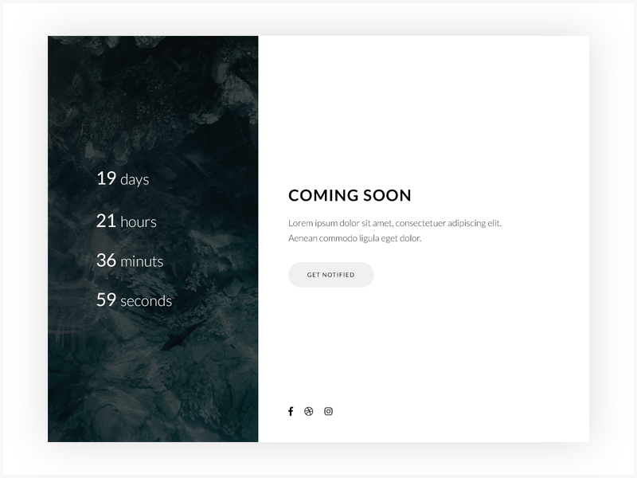

# Coming Soon Page

Erstelle eine "Coming Soon"-Webseite. Die Seite sollte einen Countdown von Tagen, Stunden, Minuten und Sekunden anzeigen.

- Um die App zu starten, versuche `$ npm run start`

- Für eine einfachere Handhabung des Datums kannst du [momentjs](https://momentjs.com) verwenden.
- Beispiel für ein fertiges Projekt 
- Inspiriert von https://dribbble.com/shots/5188890-Modern-Coming-Soon-Template